# 🩺 AI Healthcare & Fitness Platform

A smart, AI-driven mobile application designed for comprehensive health tracking, intelligent fitness planning, personalized nutrition insights, and real-time health monitoring with a clean and modern UI

---

  <table style="margin-left: auto; margin-right: auto;">
    <tr>
      <th align="center">Welcome Screen</th>
      <th align="center">Signup Screen</th>
      <th align="center">Signin Screen</th>
    </tr>
    <tr>
      <td align="center" valign="top">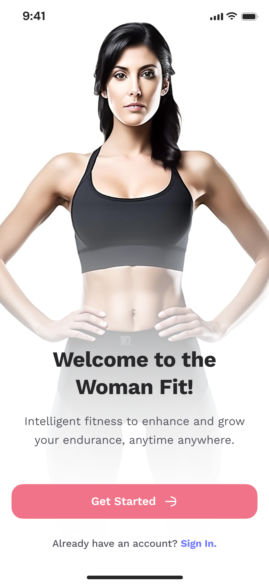</td>
      <td align="center" valign="top">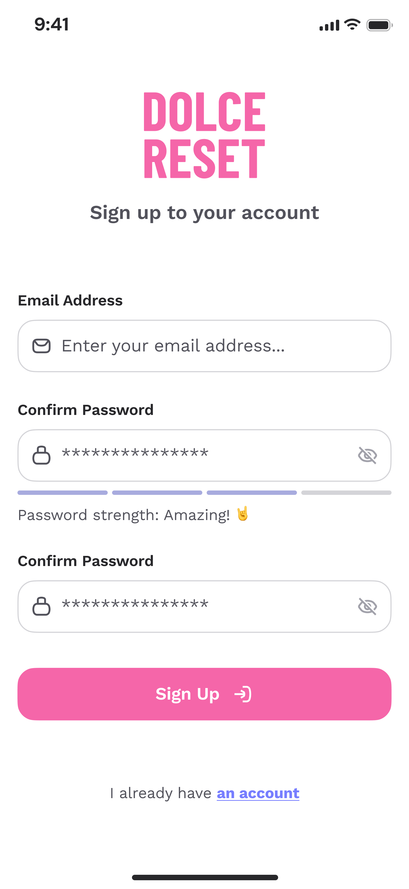</td>
      <td align="center" valign="top"></td>
    </tr>
  </table>

---

## 📏 User Physical Measurements

  <table style="margin-left: auto; margin-right: auto;">
    <tr>
      <th align="center">Height Screen</th>
      <th align="center">Weight Screen</th>
      <th align="center">Target Weight Screen</th>
    </tr>
    <tr>
      <td align="center" valign="top">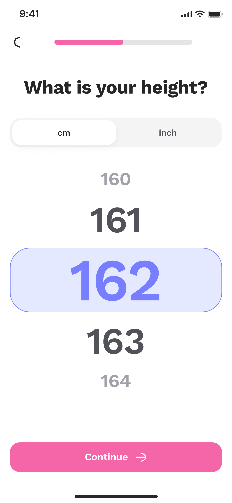</td>
      <td align="center" valign="top">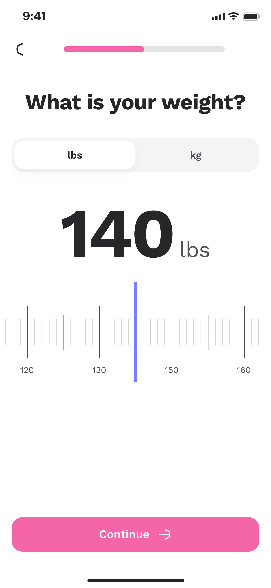</td>
      <td align="center" valign="top">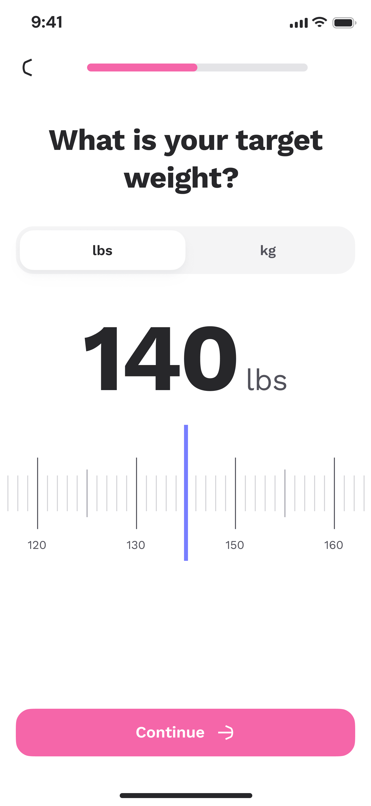</td>
    </tr>
  </table>

---

## 📋 User Agreement & Assessment

  <table style="margin-left: auto; margin-right: auto;">
    <tr>
      <th align="center">Question Screen</th>
      <th align="center">Digital Sign Screen</th>
      <th align="center">Weight Result Screen</th>
    </tr>
    <tr>
      <td align="center" valign="top">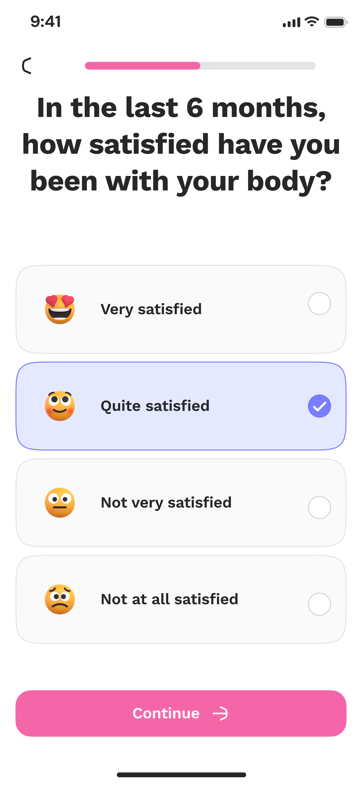</td>
      <td align="center" valign="top">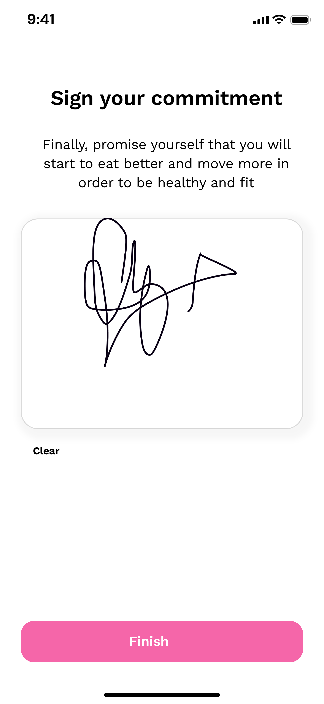</td>
      <td align="center" valign="top">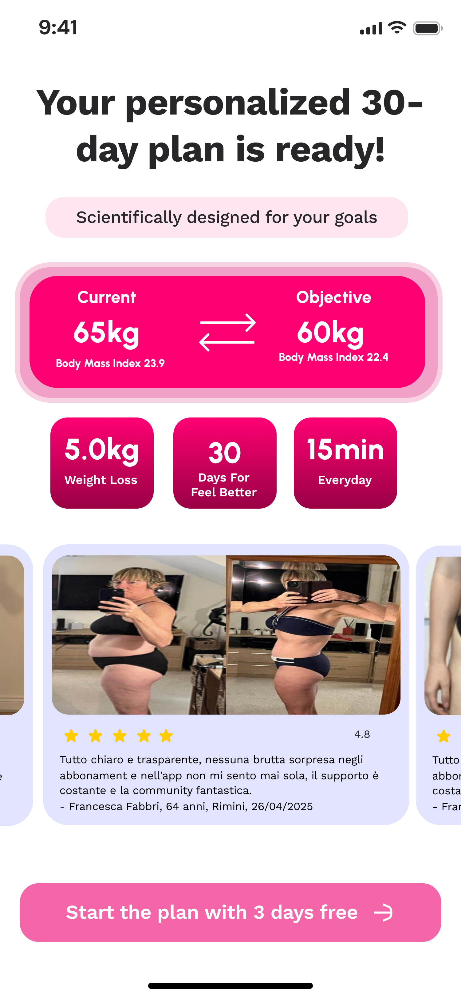</td>
    </tr>
  </table>

---

## 🏠 Dashboard & Home Screen

  <table style="margin-left: auto; margin-right: auto;">
    <tr>
      <th align="center">Home Screen</th>
      <th align="center">Workout Theme Screen</th>
    </tr>
    <tr>
      <td align="center" valign="top">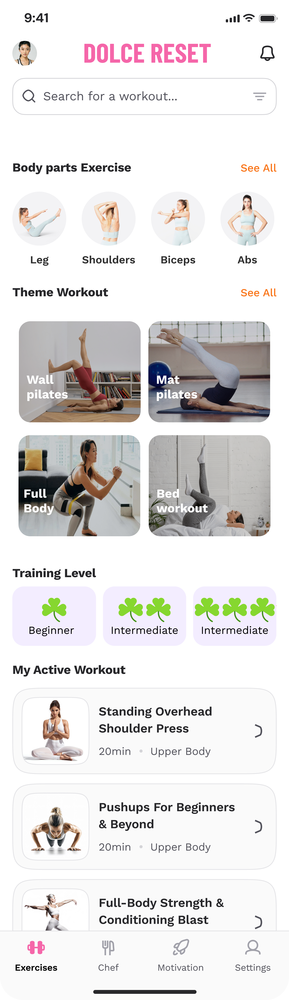</td>
      <td align="center" valign="top">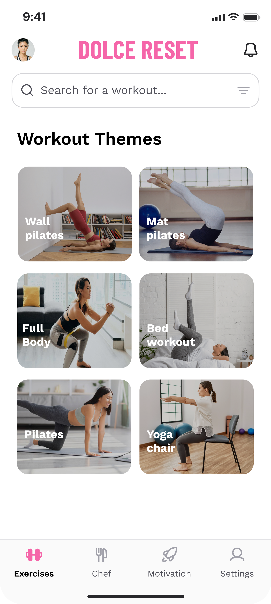</td>
    </tr>
  </table>

---

## 🏋️‍♂️ Workout & Exercise Screens

  <table style="margin-left: auto; margin-right: auto;">
    <tr>
      <th align="center">Workout Start Screen</th>
      <th align="center">Workout Congrats Screen</th>
    </tr>
    <tr>
      <td align="center" valign="top">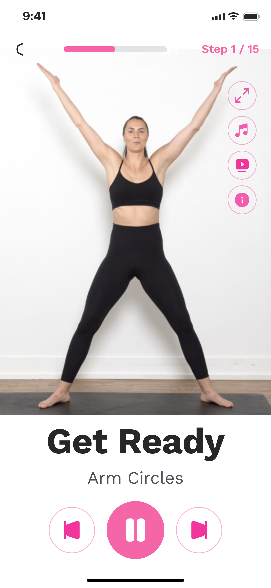</td>
      <td align="center" valign="top">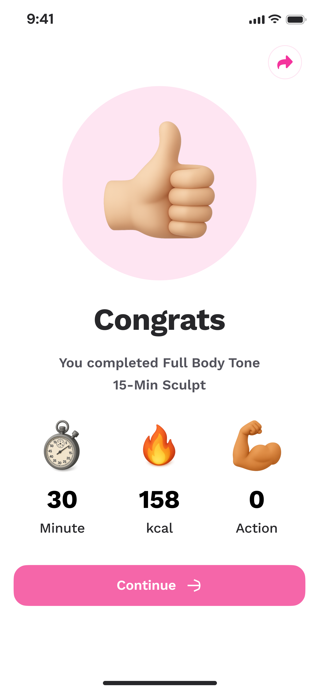</td>
    </tr>
  </table>

---

## 🍳 Chef & Meal Planning Screens

  <table style="margin-left: auto; margin-right: auto;">
    <tr>
      <th align="center">Chef Screen</th>
      <th align="center">Chef Question Screen</th>
    </tr>
    <tr>
      <td align="center" valign="top">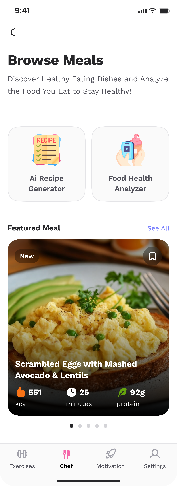</td>
      <td align="center" valign="top">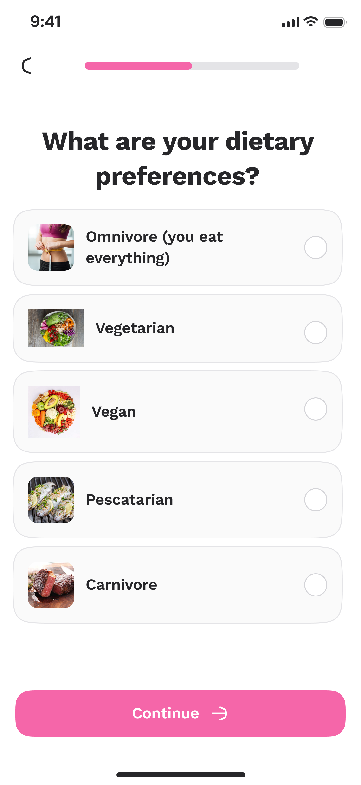</td>
    </tr>
  </table>

---

## ✨ AI Recipe & Meal Generation

  <table style="margin-left: auto; margin-right: auto;">
    <tr>
      <th align="center">AI Ingredients Screen</th>
      <th align="center">AI Result Screen</th>
    </tr>
    <tr>
      <td align="center" valign="top">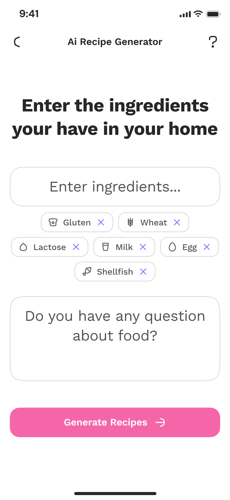</td>
      <td align="center" valign="top">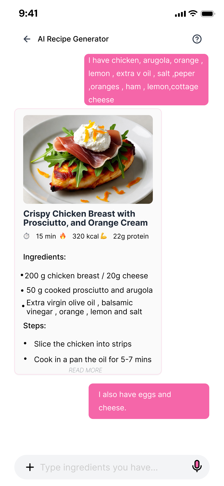</td>
    </tr>
  </table>

---

## 📸 AI Food Scanning & Recognition

  <table style="margin-left: auto; margin-right: auto;">
    <tr>
      <th align="center">AI Scan Food Screen</th>
      <th align="center">AI Result Screen</th>
    </tr>
    <tr>
      <td align="center" valign="top">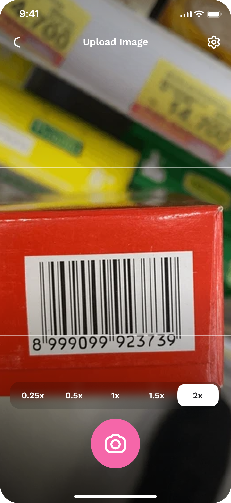</td>
      <td align="center" valign="top">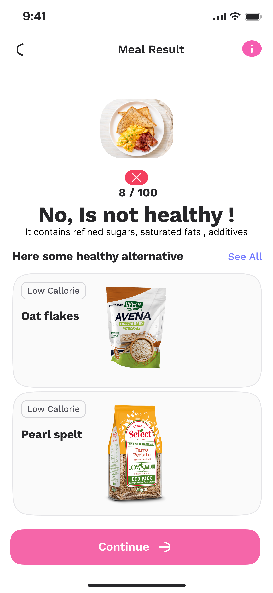</td>
    </tr>
  </table>

---

## 🔥 AI Motivation & Coaching

  <table style="margin-left: auto; margin-right: auto;">
    <tr>
      <th align="center">AI Motivation Screen</th>
    </tr>
    <tr>
      <td align="center" valign="top"></td>
    </tr>
  </table>

---

## 👤 User Profile Screen

  <table style="margin-left: auto; margin-right: auto;">
    <tr>
      <th align="center">Profile Screen</th>
    </tr>
    <tr>
      <td align="center" valign="top">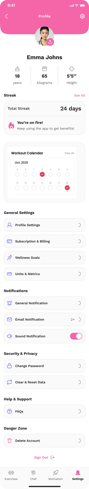</td>
    </tr>
  </table>

